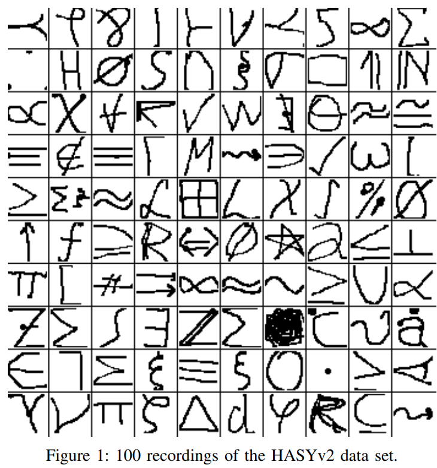

# MathRec

(WIP) project using machine learning to convert images of mathematics into relevant Latex.

## Current

### SimpleNet

<a  href="https://arxiv.org/abs/1701.08380">
https://arxiv.org/abs/1701.08380
</a>

- The [SimpleNet](math-recognition.ipynb) model is a proof of concept development using [HASY](https://arxiv.org/abs/1701.08380) dataset (similar to MNIST)
- SimpleNet's performance reaches a train test split of **88%** and **85%** with `fold-1` data 
- HASYv2 contains contains *168,233* instances of **369** classes of LaTex symbols 
- Its architecture currently relies on a convolution block to extract image features then feeding it into a feed forward layer for symbol classification, Cross Entropy loss is used
- Saved weights found at [simplenet_weights.pth](simplenet_weights.pth)
- The model is **trained in Kaggle** so all the file paths are **tied to Kaggle's default paths** for inputs and outputs
    - Modify the `root` variable to set the path for input data
    - Modify the `WEIGHTS_PATH` variable found at the end of the training cell to set the path to save weights

### Full LaTex  

- The [MathWriting Dataset](https://github.com/google-research/google-research/tree/master/mathwriting) is planned on being used to train a new model
which converts images into full mathematical strings written in LaTex.

- The start of that model is found in [MathRec](MathRec.ipynb) which contains views of the MathWriting Dataset's data among other things.
